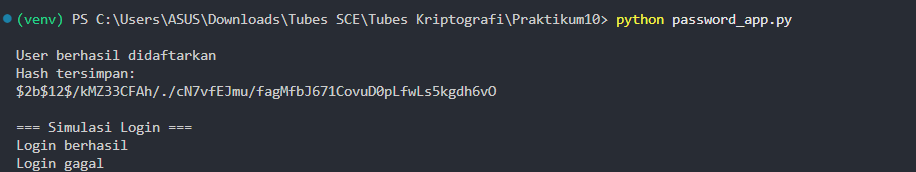
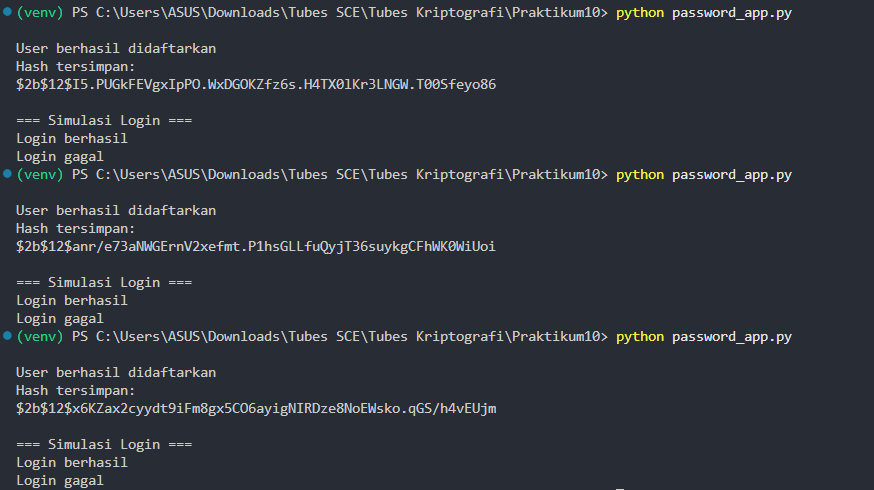
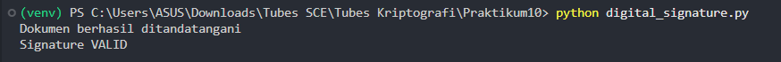
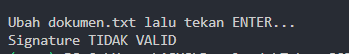
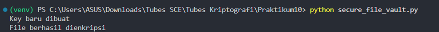
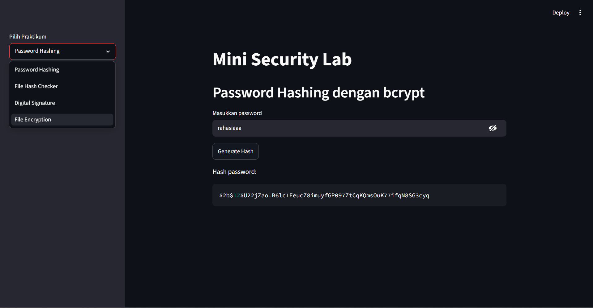
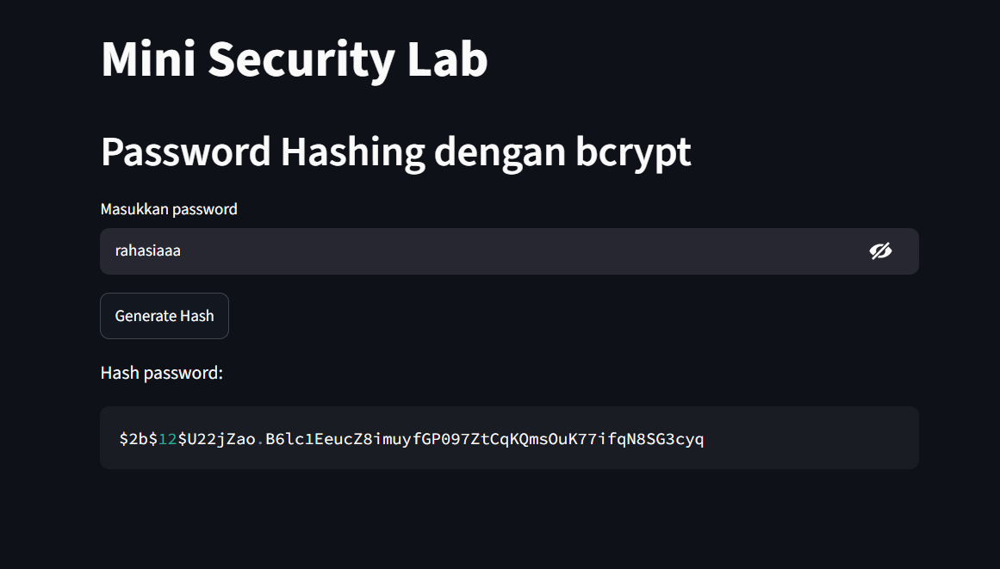
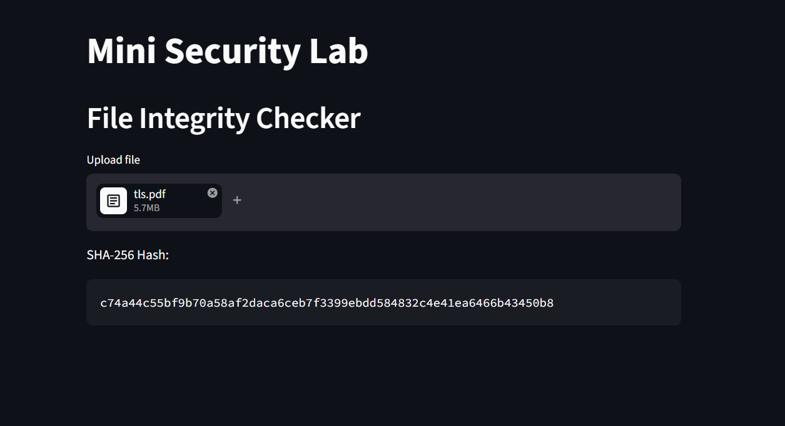
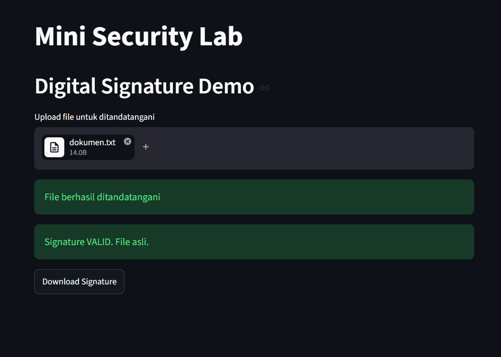
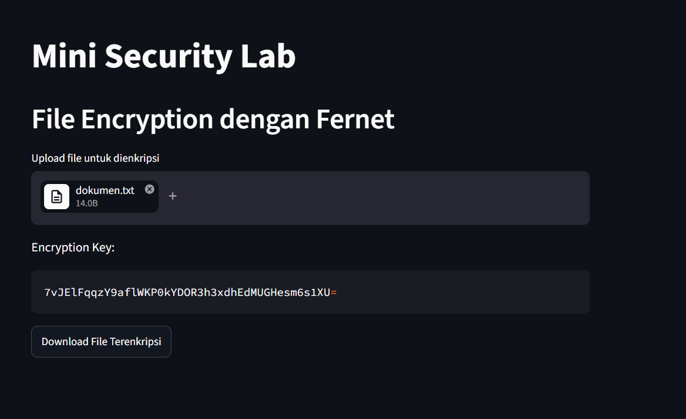

# Cryptography Security Lab

## Deskripsi

Project ini dibuat sebagai bagian dari praktikum Kriptografi dan Keamanan Informasi menggunakan Python.

Pada project ini saya mempelajari dan mengimplementasikan beberapa konsep dasar keamanan informasi, yaitu Authentication, Integrity, Confidentiality, dan Non-Repudiation melalui serangkaian studi kasus praktis.

Selain implementasi berbasis command line, seluruh konsep juga diintegrasikan ke dalam aplikasi web sederhana menggunakan Streamlit.


## Tujuan

* Memahami cara penyimpanan password yang aman menggunakan bcrypt.
* Memahami konsep integritas data menggunakan SHA-256.
* Mempelajari implementasi Digital Signature menggunakan RSA.
* Memahami proses enkripsi dan dekripsi file menggunakan Fernet.
* Mengintegrasikan seluruh konsep keamanan ke dalam satu aplikasi interaktif.


## Teknologi yang Digunakan

* Python 3.12
* bcrypt
* cryptography
* hashlib
* Streamlit


## Struktur Project

```text
cryptography-security-lab/
│
├── src/
│   ├── password_app.py
│   ├── integrity_checker.py
│   ├── digital_signature.py
│   ├── secure_file_vault.py
│   └── app.py
│
├── sample_files/
├── Screenshots/
├── requirements.txt
└── README.md
```


## Implementasi

### 1. Password Authentication System

Implementasi autentikasi menggunakan bcrypt dengan salted hash.

Fitur:

* Registrasi user
* Password hashing
* Password verification
* Salt otomatis pada setiap password

### Hasil






### 2. File Integrity Checker

Implementasi pemeriksaan integritas file menggunakan algoritma SHA-256.

Fitur:

* Perhitungan hash file
* Verifikasi perubahan file
* Demonstrasi avalanche effect

### Hasil


### 3. Digital Signature System

Implementasi tanda tangan digital menggunakan algoritma RSA.

Fitur:

* Pembuatan pasangan public key dan private key
* Penandatanganan dokumen
* Verifikasi keaslian dokumen

### Hasil






### 4. Secure File Vault

Implementasi enkripsi file menggunakan Fernet Symmetric Encryption.

Fitur:

* Enkripsi file
* Dekripsi file
* Manajemen encryption key

### Hasil




### 5. Mini Security Lab (Streamlit)

Aplikasi web sederhana yang menggabungkan seluruh konsep praktikum ke dalam satu dashboard interaktif.

Fitur:

* Password Hash Generator
* File Integrity Checker
* Digital Signature Demo
* File Encryption Tool

### Hasil












## Cara Menjalankan

Install dependency:

```bash
pip install -r requirements.txt
```

Menjalankan aplikasi Streamlit:

```bash
streamlit run src/app.py
```


## Hasil Pembelajaran

Melalui project ini saya mempelajari:

* Konsep Authentication menggunakan bcrypt
* Integritas data menggunakan SHA-256
* Digital Signature menggunakan RSA
* Confidentiality menggunakan Fernet Encryption
* Pentingnya Key Management dalam sistem keamanan
* Integrasi berbagai konsep kriptografi ke dalam aplikasi Python


## Insight

Salah satu pembelajaran paling penting dari praktikum ini adalah bahwa keamanan tidak hanya bergantung pada algoritma yang digunakan, tetapi juga pada bagaimana kunci (key) dikelola.

Pada eksperimen Secure File Vault, kehilangan encryption key menyebabkan file tidak dapat didekripsi kembali meskipun file terenkripsi masih tersedia. Hal ini menunjukkan pentingnya key management dalam implementasi keamanan yang sebenarnya.


## Author

**Michael Lim**

Mahasiswa Informatika
Fakultas Teknologi Industri
Universitas Atma Jaya Yogyakarta
